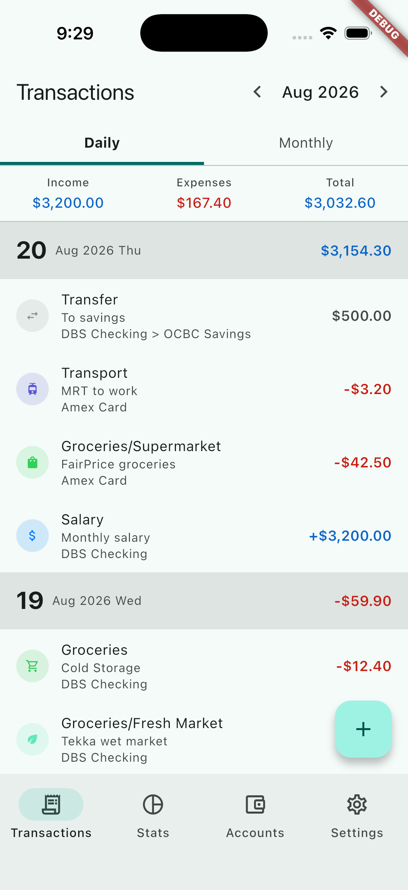
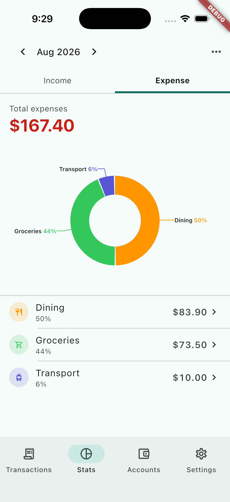
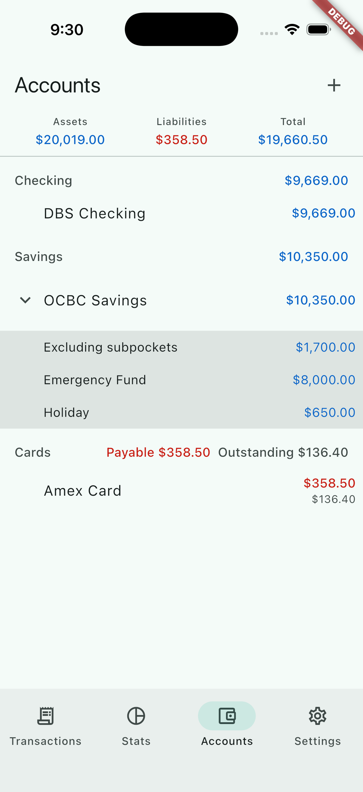

# SpendWise

A personal finance app built in Flutter. SpendWise tracks accounts, transactions, and budgets on a
domain-driven ledger, and runs on Android, iOS, macOS, Windows, Linux, and the web from one
codebase.

| Transactions | Stats | Accounts |
|---|---|---|
|  |  |  |

## Features

- **Transactions** — income, expense, and transfer entries, grouped by day with month and week
  summaries.
- **Accounts** — accounts and pockets grouped by type, with card statement balances and per-account
  net-worth inclusion.
- **Stats** — a donut chart of spending by category, with drill-down into each category's
  transactions and a trend view over time.
- **Budgets** — per-category budget limits with spend tracking against the current period.
- **Settings** — category management, recurring plans, and a recycle bin for archived accounts,
  pockets, and categories.
- **Recurring plans** — weekly, biweekly, monthly, quarterly, or yearly entries that generate
  automatically and can be edited or retired.

## Roadmap

Currently working on budgets: spending limits over category sets, with rollover. Planned after
that, in order:

1. **Receipt scan** — on-device OCR pipeline that reads a receipt and pre-fills an entry.
2. **Category classifier** — classifies unseen merchants for the receipt-scan pipeline.
3. **Sync engine** — cross-platform sync (Android, iOS, desktop, web) using the version vectors
   and deterministic occurrence ids already in the schema.
4. **Realbyte import** — CSV/Excel import from Money Manager, plus export/backup.
5. **Remainder** — amortise/split-payment wizards, search/filter, and smaller items (widgets,
   recurring-plan notifications).

Tracked as GitHub issues; see `docs/NAVIGATION.md` for the current phase table and sequencing
rules.

## Layout

- `packages/domain/` — pure Dart. Models, `LedgerState`, and accounting logic. Has no Flutter
  dependency and must never gain one, which keeps the domain portable and testable.
- `app/` — the Flutter app. Depends on `domain` by path.
- `docs/` — the feature knowledge base (`docs/knowledge/`, behavior contracts plus the decisions
  behind them), `docs/ARCHITECTURE.md`, and working procedure.
- `CONTEXT.md` — the domain glossary and index, at the repo root.

## Running the app

Requires the Flutter SDK (see `app/pubspec.yaml` for the minimum Dart SDK version) with platform
tooling for whichever target you're building (Xcode for iOS/macOS, Android Studio or the Android
SDK for Android).

```sh
cd app
flutter pub get
flutter run
```

`flutter run` prompts for a connected device or simulator if more than one is available. To target
a specific platform:

```sh
flutter run -d macos     # or ios, android, windows, linux, chrome
```

The app seeds sample data on first launch, so it's usable immediately without manual setup.

## Where to start

Read `docs/NAVIGATION.md` before making any change. It sets the reading order, the phase table,
and the sequencing rules that decide what you may touch next.

For coding conventions, comment style, testing discipline, and working procedures, see
`CLAUDE.md`.

## Checks

Run before every change is considered done:

```sh
cd packages/domain && dart format . && dart analyze && dart test
cd app && flutter analyze
```

The analyzer must report zero issues, not just zero errors.
